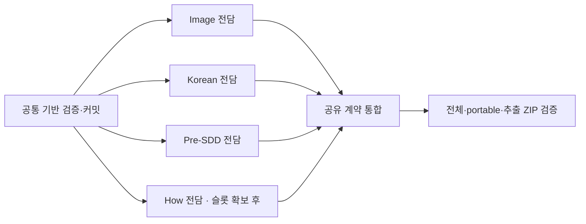

# 스킬 신뢰성 개선 실행 인덱스

상태: 승인된 [설계](../specs/2026-09-08-skills-hardening-design.md)의 제품·공유 계약 구현을 `codex/skills-hardening-implementation`에 로컬 커밋했다. 아직 main에 합쳐지지 않은 구현 브랜치의 통합 검토에 이 계획을 사용한다. 본문의 체크리스트는 승인된 실행 절차이며, 실제 검증 결과와 판단은 로컬 실행 증거에 기록한다.

총 여섯 개 구현 계획, 28개 작업이다. 현재 네 제품의 경계를 유지하면서 데이터 보존·검증 누락·판정 근거·기록 동일성을 보강한다. 감사 후보 중 반대 증거가 있는 R6와 P5는 필수 작업에서 제외했다.

## 계획과 소유권

| 순서 | 담당 / 계획 | 수정 경계 | 의존성 |
| --- | --- | --- | --- |
| 1 | 통합 담당 — [공통 기반](2026-09-08-repository-hardening.md) | `scripts/`, 관련 `tests/repository/` | 계획 완료 HEAD |
| 2a | Image 전담 — [Image Workbench](2026-09-08-image-workbench-hardening.md) | `skills/image-workbench/`, 해당 제품 tests·maintainer docs | 공통 기반 커밋 |
| 2b | Korean 전담 — [Korean Writing Editor](2026-09-08-korean-writing-editor-hardening.md) | `skills/korean-writing-editor/`, 해당 제품 tests·maintainer docs | 공통 기반 커밋 |
| 2c | Recorder 전담 — [Pre-SDD Review](2026-09-08-pre-sdd-review-hardening.md) | `skills/pre-sdd-review/`, 해당 제품 tests·maintainer docs | 공통 기반 커밋 |
| 2d | How 전담 — [How It Works](2026-09-08-how-it-works-hardening.md) | `skills/how-it-works/`, 해당 제품 tests·maintainer docs | 공통 기반 커밋, 실행 슬롯 |
| 3 | 통합 담당 — [공유 문서·배포·최종 검증](2026-09-08-skills-hardening-integration.md) | 공유 scripts·repository tests·user docs | 네 제품 reviewed commit |

제품별 독립 에이전트를 사용한다. 현재 root 포함 동시 슬롯 네 개에서는 제품 세 개를 병렬 실행하고, 먼저 끝난 슬롯에서 남은 제품을 실행한다. 공통 writer는 리뷰와 검증을 진행한다. 같은 파일을 두 writer가 수정하지 않으며 모든 stage/commit은 통합 담당이 직렬로 수행한다.

## 실행 준비와 종료 기준

실행 시 `superpowers:using-git-worktrees`로 계획 문서를 포함하는 HEAD에서 격리 작업 공간을 만들고, `superpowers:subagent-driven-development`로 task별 RED/GREEN과 독립 spec·품질 리뷰를 수행한다. 2026-09-08 사용자의 구현 요청에 따라 이 절차를 실행했다. 모델·이미지 생성 API, 사용자 설치본 교체, 원격 게시·tag·push는 포함하지 않는다.

첫 실행 기록은 gitignored `.evidence/skills-hardening/ledger.md`에 둔다. 각 task마다 아래 항목을 채운다. 기록기의 READY가 아니라 실제 테스트와 리뷰 결과를 적는다.

| 필드 | 기록할 값 |
| --- | --- |
| 기준 | 시작 HEAD, worktree 경로, Python·OS, 변경 전 dirty 상태 |
| 작업 | 계획 파일, task 번호, 담당 에이전트, 수정 파일 |
| RED | 반례 명령, 실제 실패 원인, 종료 코드 |
| GREEN | 회귀 명령, 실제 결과, 로그 위치 |
| 검토 | spec·품질 검토 결과, 미해결 finding, 필요한 수정 범위 |
| 통합 | 직렬 커밋 ID와 그 커밋을 검증한 명령 |
| 증거 한계 | verified / failed / not_measured 구분 |

공통 배포 검사는 Git 인덱스의 payload를 빌드하고 현재 소스와 비교한다. 제품 writer가 수정 중일 때 전체 release 검사를 돌리면 서로 다른 바이트를 비교하게 된다. 따라서 공통 기반은 제품 작업 전에 검증·커밋하고, 제품은 자체 회귀 검사 후 직렬 커밋하며, 전체·ZIP 검사는 모든 변경이 합쳐진 뒤 수행한다.

제품별 `--skill` 통과만으로 완료하지 않는다. 마지막에는 selector 없는 full, windows-portable, 네 제품의 추출 ZIP 검증, 반례 및 독립 통합 리뷰가 필요하다. 새 수정·실패가 없으면 동일 전체 검증을 반복하지 않는다. macOS의 portable profile 통과를 native Windows 증거로 보고하지 않는다.

## 설계 추적

| 설계 항목 | 구현 계획의 책임 |
| --- | --- |
| R1 공통 CI 누락 | 공통 기반 Task 2 |
| R2 다운로드 원본 결속 | 공통 기반 Task 3, 통합 Task 3 |
| R3 레지스트리·빈 단계 | 공통 기반 Task 1 |
| R4 멱등 설치·clone 경로 | How 제품의 설치 안내, 통합 Task 1 |
| R5 standalone 문서 링크 | 네 제품 README, 통합 Task 1 |
| I1 입력 파일 보존 | Image 계획의 출력 동일성 검사 |
| I2 최소 이미지 구조 검사 | Image 계획의 parser 회귀 |
| I3 독립 행동 불변식 | Image 계획의 오프라인 evaluator |
| K1 의미·귀속 미측정 | Korean 계획의 판정 차원·상태 전파 |
| K2 diagnose 수치 미언급 | Korean 계획의 숫자 증거 분류 |
| K3 실행 관측 | Korean 계획의 transport·runner identity |
| K4 모드 충돌 | Korean 계획의 문법 지침·fixture |
| H1 깊이 우선순위 | How 계획의 승인된 기본 동작 변경 |
| H2 출력·출처 계약 | How 계획의 여섯 요소·말투·출처 정책 |
| H3 증거 결속 | How 계획의 historical-unbound와 새 기록 |
| H4 검증 차원 | How 계획의 fence/hop·loading·syntax·meaning 분리 |
| P1 checkout 식별 | Pre-SDD 계획의 schema 3·로컬 HMAC |
| P2 원자적 상태 전이 | Pre-SDD 계획의 salt 초기화·run별 OS 잠금 |
| P3 손상 기록 | Pre-SDD 계획의 strict reader·summary 격리 |
| P4 모순 관찰 | Pre-SDD 계획의 anomaly 보존·분리 집계 |
| 버전·문서·추출본 | 각 제품 release task, 통합 Task 2–3 |
| R6·P5 후보 | 이번 완료 조건에서 제외 |

## 계획 사이의 고정 인터페이스

- 공통 `matrix_for_paths`는 selector 없는 전체 검사와 제품 selector 검사를 구분한다. 소비 workflow의 JSON row 형식은 유지한다.
- 다운로드 비교는 `payload_sha256`를 재사용하며 추출본 코드 실행 전에 실패한다. 제품 업데이트 뒤 신뢰 소스와 버전이 다르면 성공으로 완화하지 않는다.
- How 설치 문서의 marker는 `<!-- how-it-works-local-links -->`이고 바로 다음 Python block은 source/target 두 인수를 받는다. 공유 문서가 같은 block을 사용하고 integration test가 실제 문서 코드를 실행한다.
- Korean live harness는 새 runner identity를 사용한다. 이전 receipt는 새 판정의 실행 근거로 재사용하지 않는다. 문서에는 문자열 heuristic과 실모델 측정의 차이를 남긴다.
- Pre-SDD CLI는 3.0.0/schema 3 canonical JSON을 제공한다. schema 2 기록은 읽기 전용 historical-unbound이며 기존 pending을 덮어쓰지 않는다. HMAC 입력에는 정규화한 Git 디렉터리와 checkout root를 함께 넣어 worktree 이동도 구분한다. 현재 checkout 결속과 recorder 선택성은 별개 계약이다.
- image-workbench·korean-writing-editor는 2.0.2, how-it-works는 2.0.0, pre-sdd-review는 3.0.0이다. 기존 catalog v2.0.0 및 과거 record fixture를 일괄 버전 치환하지 않는다.

## 검토 기준

이 계획의 품질 기준은 실제 실패 경로와 대응 테스트, 확인한 함수·파일 이름, 작업 간 인터페이스의 일치다. 모델 행동에 관한 지침의 문구 검사와 합성 evaluator 테스트만으로 실사용 품질을 측정했다고 하지 않는다. 실제 모델 품질과 renderer별 시각·접근성 평가는 후속 측정 후보로 남긴다.
