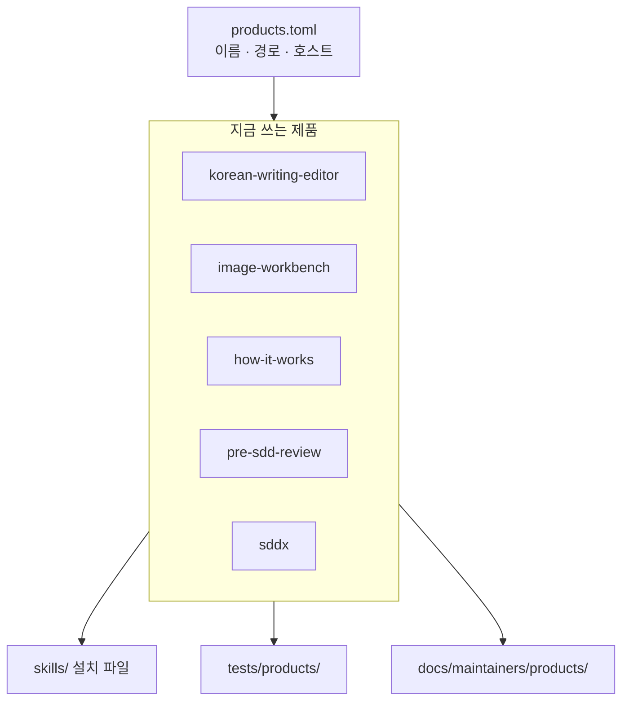

# 저장소 구조

이 저장소에는 따로 설치하는 스킬 다섯 개가 있습니다. 무엇을 고칠 때 어디를 보고
무엇을 검사하는지 이 문서가 정합니다. Apache-2.0은 루트와 각 스킬에 적용됩니다.

## 한눈에

지금 쓰는 제품은 `products.toml`이 가리키는 `korean-writing-editor`,
`image-workbench`, `how-it-works`, `pre-sdd-review`, `sddx`입니다. 각자 버전을
매기고, GitHub 경로로 하나씩 설치합니다.



저장소 루트는 개별 스킬을 GitHub 경로로 설치하는 작업 공간입니다.
플러그인 메타데이터는 루트가 소유하지 않습니다. 루트에는 `.codex-plugin/`이
없습니다.

어디를 보는지:

| 할 일 | 문서 |
| --- | --- |
| 설치·고르기 | [사용자 안내](../../users/ko/installation.md), 각 제품 README |
| 제품 동작 바꾸기 | 해당 `contract.md`와 `SKILL.md` |
| 트리 경계·검사 범위 | 이 문서 |
| 버전·태그 | [버저닝](versioning.md) |

## 말 뜻

계약 식별자는 영어 그대로 둡니다. 아래는 읽는 말만 풀어 쓴 것입니다.
`SKILL.md`와 런타임 `references/`는 에이전트가 읽는 실행 계약이라 영어입니다.
사람이 읽는 한국어는 제품 README입니다.

| 말 | 뜻 |
| --- | --- |
| 설치 파일 | 사용자가 받는 스킬 폴더. `skills/<name>/` |
| 개발 증거 | 테스트·관리자 문서. 설치에 넣지 않음 |
| 독립 제품 | `products.toml`에 있는, 하나씩 설치하는 스킬. 일상어로는 지금 쓰는 스킬 |
| payload | ZIP 안에 든 스킬 파일 묶음 |
| 호스트 | 스킬을 실행하는 프로그램. Codex, Claude Code, Grok |
| 지원 OS | macOS만. Windows와 Linux는 미지원. Ubuntu CI 통과는 OS 지원이 아님 |
| worker | 구현만 맡는 외부 CLI. Cursor, Grok CLI. 호스트가 아님 |
| selector | 어떤 검사만 돌릴지 고르는 옵션. `--skill <name>` |
| digest | payload의 SHA-256 지문. 테스트는 문서를 이 방식으로 핀하지 않고 문구·사실만 확인함 |
| 픽스처 | 미리 만들어 둔 검사 예시 |
| smoke | 실제로 한 번 돌려 보는 설치·실행 확인 |
| `not_measured` | 아직 이 환경에서 확인하지 않음 |
| `historical-unbound` | 예전 기록. 지금 실행 증거가 아님 |
| `current-bounded` | 버전과 hash만 묶임. 실제 실행은 증명하지 않음 |

## 설치 파일과 개발 증거

GitHub 경로로 설치하면 `skills/<name>/`만 받습니다. 실행에 필요한 파일과 사용자
안내는 여기에 둡니다. 테스트, 관리자 문서, 라이브 증거, 저장소 운영 도구는 설치
밖에 둡니다.

설치에 들어갑니다.

| 경로 | 역할 |
| --- | --- |
| `skills/<name>/SKILL.md`, `references/`, `agents/`, `LICENSE.txt`, 런타임 `scripts/` | 실행 계약과 런타임 |
| `skills/<name>/README.md`, `README.en.md` | 제품 사용자 안내 |
| `skills/<name>/CHANGELOG.md` | 제품 변경 이력 |
| `skills/<name>/release.toml` | 제품 버전 원본 |

저장소에만 있습니다. 설치하지 않습니다.

| 경로 | 역할 |
| --- | --- |
| `products.toml` | 현재 독립 제품 목록. [제품 목록](products-registry.md) |
| `tests/repository/` | 매니페스트, 링크, 패키징, 공개 문서 사실 |
| `tests/products/korean-writing-editor/offline/` | 결정적 트리거·모드·보존·출력 테스트 예시 |
| `tests/products/korean-writing-editor/live/` | 합성 라이브 실행 도구, 단위 테스트, dry-run, 운영 안내 |
| `tests/products/image-workbench/` | 라우팅, 권한, 증거, inspector 테스트 |
| `tests/products/how-it-works/` | 합성 DNS·rebase 규칙과 설치 파일 테스트 예시 |
| `tests/products/pre-sdd-review/` | 합성 설계·계획 규칙 테스트 예시 |
| `tests/products/sddx/` | backend 신원 픽스처와 제품 계약 |
| `docs/README.md` | 설치·사용·관리·기록 라우팅 |
| `docs/users/` | 공유 설치·호환성·안전·검증 안내 |
| `docs/maintainers/` | 구조, 제품 목록, 버저닝, 릴리스, 제품 규칙 |
| `docs/history/` | 진행 중인 설계·계획. 현재 계약을 정의하지 않음 |
| `scripts/verify.py` | 모델 없는 검사 스크립트 |
| `scripts/changed_targets.py` | 바뀐 경로로 CI 검사 범위를 고르는 스크립트 |
| `scripts/release.py` | 제품 check/build/verify-download. [릴리스](release.md) |

설치 폴더 규칙:

- `CHANGE_PROTOCOL.md`, `evals/`, `tests/`를 두지 않습니다.
- `README.md`, `README.en.md`, `CHANGELOG.md`, `release.toml`은 허용되며 필수입니다.
- `image-workbench` inspector `skills/image-workbench/scripts/inspect_asset.py`는
  런타임 코드입니다. 테스트는 `tests/products/image-workbench/`에 둡니다.
  inspector는 스킬 루트에서 `python3 scripts/inspect_asset.py`로 호출합니다.
  저장소 상대 `skills/` 경로로 호출하지 않습니다.

제품별 픽스처 경로의 세부는 각 제품 `testing.md`가 소유합니다.

## 인터페이스

- 스킬 식별: 디렉터리 이름, `SKILL.md` `name`, 해당 제품 `release.toml` 이름이
  같아야 합니다. `release.toml` 버전과 `SKILL.md` `metadata.version`도 같아야
  합니다. `license: Apache-2.0`은 최상위 frontmatter입니다.
- 공개 사실: 한영 사용자 문서는 명령, 지원 상태, 한계가 일치해야 합니다.
  현재 버전 리터럴은 제품 `release.toml`이 소유합니다.

## 검증 경계

필수 로컬 검증:

```bash
python3 scripts/verify.py
```

이 명령은 자격 증명과 공급자 호출 없이 돕니다. 좁혀 돌리려면 selector를 붙입니다.

- 제품만: `python3 scripts/verify.py --skill <name>`

어떤 검사를 돌릴지는 바뀐 경로로 고릅니다. 공통 경로, unknown 경로, 빈 diff, diff 실패이면 selector 없는 전체 검사를 실행합니다. 제품 전용 변경일 때만 해당 제품 selector로 좁은 검사를 실행합니다.
제품 전용 경로는 `products.toml`의 `owned_paths`입니다. CI에서는 `scripts/changed_targets.py`가 이 규칙으로 검사
범위를 정합니다.

한국어 라이브 평가는 명시적인 로컬 작업입니다.

제품 프로토콜은
[korean-writing-editor](../products/korean-writing-editor/contract.md),
[image-workbench](../products/image-workbench/contract.md),
[how-it-works](../products/how-it-works/contract.md),
[pre-sdd-review](../products/pre-sdd-review/contract.md),
[sddx](../products/sddx/contract.md)를 보세요.
레지스트리는 [products-registry.md](products-registry.md), 독립 릴리스는
[release.md](release.md)입니다.
