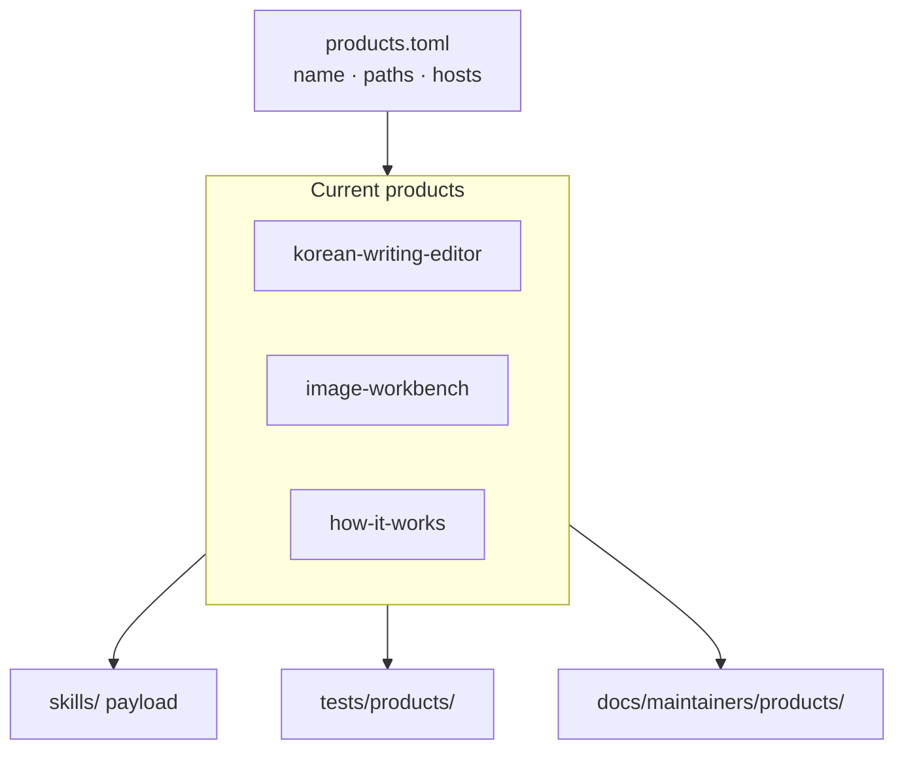

# Repository architecture

This repository holds three skills that install separately. This doc says where to look
and what to check when you change something. Apache-2.0 applies to the root and to
each skill.

## At a glance

The current products are the ones in `products.toml`: `korean-writing-editor`,
`image-workbench`, and `how-it-works`. Each has
its own version and installs on its own from a GitHub path.


```mermaid
flowchart TB
  R["products.toml<br/>name · paths · hosts"]
  subgraph live ["Current products"]
    K[korean-writing-editor]
    I[image-workbench]
    H[how-it-works]
  end
  R --> live
  live --> SK["skills/ payload"]
  live --> T["tests/products/"]
  live --> D["docs/maintainers/products/"]
```

The repository root is a workspace for installing single skills by GitHub path.
The root does not own plugin metadata. There is no `.codex-plugin/` at the root.

Where to look:

| Task | Doc |
| --- | --- |
| Install or choose a skill | [User guide](../../users/en/installation.md), each product README |
| Change product behavior | That product's `contract.md` and `SKILL.md` |
| Tree boundaries and check scope | This doc |
| Versions and tags | [Versioning](versioning.md) |

## Terms

Contract identifiers stay as written. `SKILL.md` and runtime `references/` are
English because agents run them. Product `README.md` and product maintainer docs are
English; the Korean guide is `README.ko.md`
([products registry](products-registry.md#doc-languages)).

| Term | Meaning |
| --- | --- |
| payload | The skill folder users install: `skills/<name>/`. Also the file set inside a release ZIP |
| development evidence | Tests and maintainer docs. Never installed |
| standalone product | A skill listed in `products.toml` that installs on its own |
| host | The program that runs a skill: Codex, Claude Code, Cursor Agent, or Grok. Each product's `supported_hosts` in `products.toml` decides |
| supported OS | macOS only. Windows and Linux are unsupported. Passing Ubuntu CI is not OS support |
| selector | An option that narrows which checks run: `--skill <name>` |
| digest | The SHA-256 fingerprint of a payload. Tests never pin docs this way; they check phrases and facts |
| fixture | A prepared test example |
| smoke | One real install-and-run check |
| `not_measured` | Not yet checked in this environment |
| `current-bounded` | Tied to a version and hash only. Does not prove a real run |

## Payload and development evidence

A GitHub-path install fetches only `skills/<name>/`. Files needed at run time and user
guides go there. Tests, maintainer docs, live evidence, and repository tools stay
outside the payload.

In the payload:

| Path | Role |
| --- | --- |
| `skills/<name>/SKILL.md`, `references/`, `agents/`, `LICENSE.txt`, runtime `scripts/` | Run contract and runtime |
| `skills/<name>/README.md` (English), `README.ko.md` (Korean) | Product user guide |
| `skills/<name>/CHANGELOG.md` | Product change history |
| `skills/<name>/release.toml` | Product version source |

Repository only, never installed:

| Path | Role |
| --- | --- |
| `products.toml` | Current standalone product list. See [products registry](products-registry.md) |
| `tests/repository/` | Manifest, links, packaging, public doc facts |
| `tests/products/korean-writing-editor/offline/` | Deterministic trigger, mode, preservation, and output fixtures |
| `tests/products/korean-writing-editor/live/` | Synthetic live runner, unit tests, dry-run, operator notes |
| `tests/products/image-workbench/` | Routing, permission, evidence, and inspector tests |
| `tests/products/how-it-works/` | Synthetic DNS and rebase fixtures and payload tests |
| `docs/README.md` | Routes to install, use, maintain, and history |
| `docs/users/` | Shared install, compatibility, safety, and verification guides |
| `docs/maintainers/` | Architecture, registry, versioning, release, product rules |
| `docs/history/` | Work-in-progress designs and plans. Does not define the current contract |
| `docs/research/` | Measured studies of skills and workflows, including retired products, and their harnesses. Does not define the current contract. Live-call code is not verified |
| `docs/learning/` | Durable decision cases and conditional insights. See [learning](../../learning/README.md). Historical names are evidence, not supported products or aliases |

The learning index, cases, insights, and templates are Korean originals. They have
no parallel English copy; product and maintainer documentation keep their existing
language rules.
| `scripts/verify.py` | Model-free checks |
| `scripts/changed_targets.py` | Picks the CI check scope from changed paths |
| `scripts/release.py` | Product check, build, verify-download. See [release](release.md) |

Payload folder rules:

- No `CHANGE_PROTOCOL.md`, `evals/`, or `tests/`.
- `README.md`, `README.ko.md`, `CHANGELOG.md`, and `release.toml` are allowed and
  required.
- The `image-workbench` inspector `skills/image-workbench/scripts/inspect_asset.py` is
  runtime code; its tests live in `tests/products/image-workbench/`. Call it by its
  path under the skill root, `python3 <skill-root>/scripts/inspect_asset.py
  <absolute-asset-path>`, never by a repository-relative `skills/` path.

Each product's `testing.md` owns its fixture path details.

## Interfaces

- Skill identity: the folder name, `SKILL.md` `name`, and the product's `release.toml`
  name must match. The `release.toml` version must equal `SKILL.md`
  `metadata.version`. `license: Apache-2.0` is top-level frontmatter.
- Public facts: Korean and English user docs must agree on commands, support status,
  and limits. The product's `release.toml` owns the current version literal.

## Verification scope

Required local check:

```bash
python3 scripts/verify.py
```

It runs with no credentials and no provider calls. To narrow it to one product, add
the selector: `python3 scripts/verify.py --skill <name>`.

Changed paths decide the scope. Shared paths, unknown paths, an empty diff, or a
failed diff run the full check without a selector. Only a product-only change runs
the narrow check with that product's selector. Product-only paths are the
`owned_paths` in `products.toml`. In CI, `scripts/changed_targets.py` applies this
rule.

Korean live evaluation is an explicit local task.

Product protocols:
[korean-writing-editor](../products/korean-writing-editor/contract.md),
[image-workbench](../products/image-workbench/contract.md),
[how-it-works](../products/how-it-works/contract.md).
